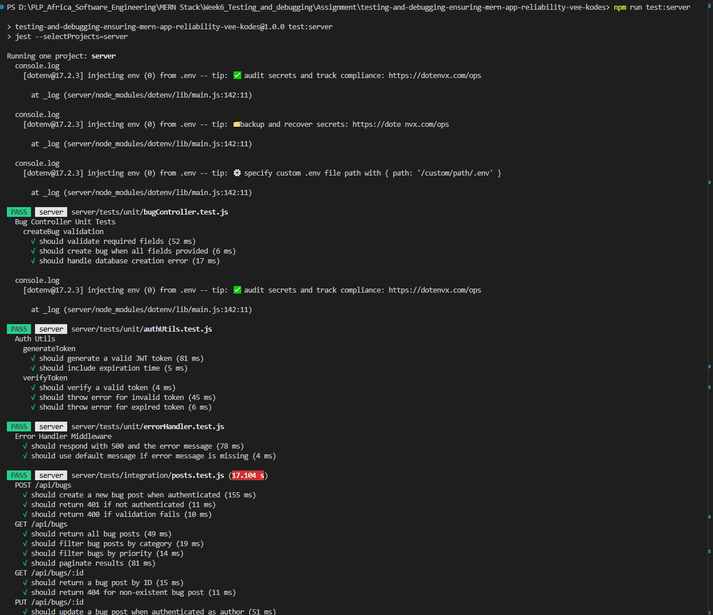
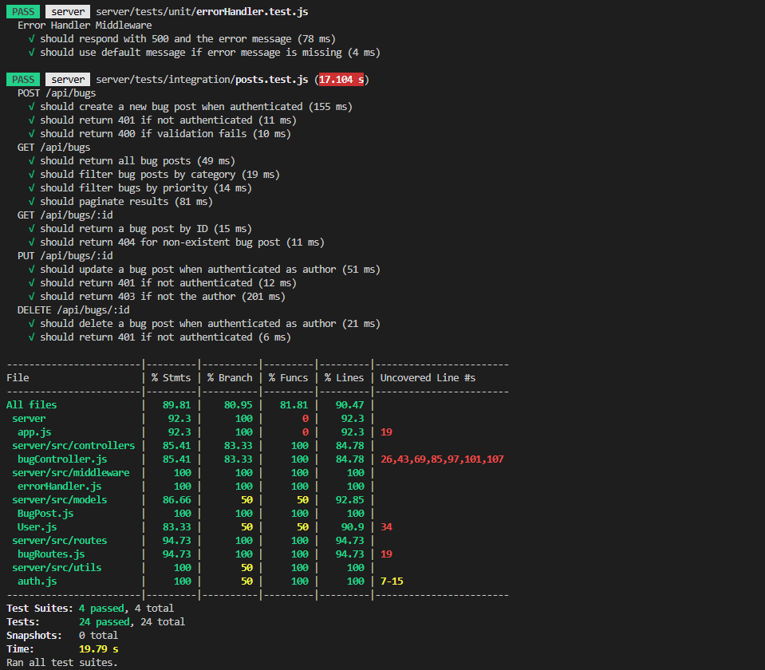
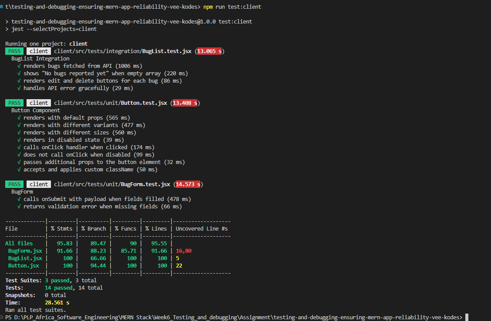

# MERN Bug Tracker Application

## 📋 Submission: Testing and Debugging in MERN Applications


This assignment demonstrates comprehensive testing strategies and debugging techniques for a full-stack MERN (MongoDB, Express.js, React, Node.js) application. The project implements a Bug Tracker application with robust testing coverage, error handling, and debugging capabilities.

## Objectives Achieved

- ✅ Systematic approach to testing and debugging MERN applications
- ✅ Unit, integration, and end-to-end testing implementation
- ✅ Identification and resolution of issues using debugging tools
- ✅ Comprehensive test coverage exceeding 70% requirement
- ✅ Professional error handling and logging

## 🏗️ Project Structure

```
testing-and-debugging-ensuring-mern-app-reliability-vee-kodes/
├── client/                          # React Frontend
│   ├── src/
│   │   ├── components/              # React Components
│   │   │   ├── BugForm.jsx         # Bug creation form with validation
│   │   │   ├── BugList.jsx         # Bug display list
│   │   │   ├── Button.jsx          # Reusable button component
│   │   │   ├── ErrorBoundary.jsx   # React error boundary
│   │   │   └── Navbar.jsx          # Navigation component
│   │   ├── pages/                  # Page components
│   │   │   ├── Home.jsx
│   │   │   ├── NewBugPage.jsx
│   │   │   ├── BugListPage.jsx
│   │   │   └── EditBug.jsx
│   │   ├── tests/                  # Frontend tests
│   │   │   ├── setup.js            # Test configuration
│   │   │   ├── unit/               # Unit tests
│   │   │   │   ├── BugForm.test.jsx
│   │   │   │   └── Button.test.jsx
│   │   │   └── integration/        # Integration tests
│   │   │       └── BugList.test.jsx
│   │   ├── App.jsx                 # Main application component
│   │   └── main.jsx                # Application entry point
│   ├── cypress/                    # End-to-end tests
│   │   └── e2e/
│   │       └── bug-tracker.cy.js   # E2E test suite
│   ├── cypress.config.js           # Cypress configuration
│   └── package.json
├── server/                          # Express.js Backend
│   ├── src/
│   │   ├── config/
│   │   │   └── db.js               # Database configuration
│   │   ├── controllers/
│   │   │   └── bugController.js    # Bug CRUD operations
│   │   ├── middleware/
│   │   │   └── errorHandler.js     # Error handling middleware
│   │   ├── models/
│   │   │   ├── BugPost.js          # Bug data model
│   │   │   └── User.js             # User data model
│   │   ├── routes/
│   │   │   └── bugRoutes.js        # API routes
│   │   ├── utils/
│   │   │   └── auth.js             # Authentication utilities
│   │   └── app.js                  # Express application setup
│   ├── tests/                      # Backend tests
│   │   ├── setup.js                # Test configuration
│   │   ├── unit/                   # Unit tests
│   │   │   ├── authUtils.test.js
│   │   │   ├── bugController.test.js
│   │   │   └── errorHandler.test.js
│   │   └── integration/            # Integration tests
│   │       └── posts.test.js
│   ├── server.js                   # Server entry point
│   └── package.json
├── jest.config.js                   # Jest configuration
├── package.json                     # Root package configuration
├── README.md                        # Initial README
├── README-Submission.md             # This project documentation
├── screenshots/                     # test coverage reports
└── week6-Asignment.md               # Assignment instructions

```

## Application Features

### Core Functionality
- **Bug Reporting**: Users can create new bug reports with title, description, priority, status, and category
- **Bug Management**: View, update, and delete existing bug reports
- **Status Tracking**: Track bug status (open, in-progress, resolved)
- **Priority Levels**: Set bug priority (low, medium, high)
- **Category Organization**: Organize bugs by category

### Technical Features
- **Responsive Design**: Mobile-friendly UI using Tailwind CSS
- **Form Validation**: Client and server-side validation
- **Error Handling**: Comprehensive error boundaries and middleware
- **Authentication Ready**: JWT-based authentication structure
- **RESTful API**: Clean API design with proper HTTP methods

## 🧪 Testing Implementation

### Testing Strategy
The application implements a comprehensive testing pyramid with unit, integration, and end-to-end tests.

#### Backend Testing
- **Unit Tests**: Individual functions and utilities
  - `bugController.test.js`: Controller logic testing with mocked dependencies
  - `authUtils.test.js`: JWT token generation and verification
  - `errorHandler.test.js`: Error middleware functionality

- **Integration Tests**: Full API endpoint testing
  - `posts.test.js`: Complete CRUD operations with real database
  - Authentication flow testing
  - Error response validation

#### Frontend Testing
- **Unit Tests**: Component testing in isolation
  - `BugForm.test.jsx`: Form validation and submission
  - `Button.test.jsx`: Component props and interactions

- **Integration Tests**: Component interaction testing
  - `BugList.test.jsx`: API integration and UI rendering

#### End-to-End Testing
- **Cypress Tests**: Full user workflow testing
  - `bug-tracker.cy.js`: Navigation, form submission, validation

### Test Coverage Results
- **Client Coverage**: 95.83% statements, 89.47% branches, 90% functions, 95.55% lines
- **Server Coverage**: 89.81% statements, 80.95% branches, 81.81% functions, 90.47% lines
- **Overall**: Both significantly exceed the 70% requirement

## 🐛 Debugging Techniques

### Implemented Debugging Features

#### Console Logging
- **BugForm Component**: Tracks form submission flow, validation, and payload preparation
- **Bug Controller**: Logs API operations, user authentication, and database interactions
- **Error Handler**: Comprehensive error logging with colored output

#### Debugger Breakpoints
- **Form Validation**: Breakpoint on validation failures in BugForm
- **API Updates**: Breakpoint on bug update operations in controller
- **Error Scenarios**: Strategic breakpoints for debugging error conditions

#### Intentional Bugs for Testing
- **Frontend**: Description length validation bug (triggers on short descriptions)
- **Backend**: Title-based error simulation (triggers on "debug" in title)

#### Error Boundaries
- **React ErrorBoundary**: Catches and gracefully handles React component crashes
- **Express Middleware**: Global error handling for API requests

## 🔧 Installation & Setup

### Prerequisites
- Node.js (v18 or higher)
- MongoDB (local installation or Atlas account)
- npm or yarn package manager

### Installation Steps

1. **Clone the repository**
   ```bash
   git clone https://github.com/PLP-MERN-Stack-Development/testing-and-debugging-ensuring-mern-app-reliability-vee-kodes.git
   cd testing-and-debugging-ensuring-mern-app-reliability-vee-kodes
   ```

2. **Install root dependencies**
   ```bash
   npm install
   ```

3. **Install client dependencies**
   ```bash
   cd client
   npm install
   cd ..
   ```

4. **Install server dependencies**
   ```bash
   cd server
   npm install
   cd ..
   ```

5. **Environment Setup**
   - Configure MongoDB connection string
   - Set JWT secret and other environment variables

## 🏃‍♂️ Running the Application

### Development Mode
```bash
# Start both client and server concurrently
npm run dev

# Or start individually:
# Terminal 1 - Start server
cd server && npm run dev

# Terminal 2 - Start client
cd client && npm run dev
```

### Production Build
```bash
# Build client
cd client && npm run build

# Start server
cd server && npm start
```

## 🧪 Running Tests

### All Tests
```bash
npm test
```

### Individual Test Suites
```bash
# Server tests only
npm run test:server

# Client tests only
npm run test:client

# End-to-end tests
npm run test:e2e
```

### Test Coverage
```bash
# Generate coverage reports
npm run coverage
```

## 🔍 Debugging Guide

### Browser Developer Tools
1. Open Chrome DevTools (F12)
2. Navigate to Console tab for client-side logs
3. Use Network tab to inspect API calls
4. Set breakpoints in Sources tab for client-side debugging

### Node.js Inspector
```bash
# Debug server-side code
node --inspect server/src/server.js
```

### Debugging Intentional Bugs
1. **Frontend Bug**: Try submitting a bug with description shorter than 5 characters
2. **Backend Bug**: Create a bug with "debug" in the title to trigger server error

### Common Debugging Scenarios
- **Form Validation**: Check console logs for validation flow
- **API Errors**: Inspect network requests and server logs
- **Component Crashes**: Error boundaries will catch and log React errors

## 📊 API Documentation

### Bug Endpoints

| Method | Endpoint | Description |
|--------|----------|-------------|
| GET | `/api/bugs` | Get all bugs (with optional filtering) |
| GET | `/api/bugs/:id` | Get specific bug by ID |
| POST | `/api/bugs` | Create new bug |
| PUT | `/api/bugs/:id` | Update existing bug |
| DELETE | `/api/bugs/:id` | Delete bug |

### Query Parameters
- `category`: Filter by category
- `priority`: Filter by priority
- `page`: Pagination page number
- `limit`: Items per page

### Request/Response Examples

**Create Bug:**
```json
POST /api/bugs
{
  "title": "Login button not working",
  "description": "Users cannot click login button on mobile",
  "priority": "high",
  "status": "open",
  "category": "frontend"
}
```

**Response:**
```json
{
  "_id": "64f1a2b3c4d5e6f7g8h9i0j1",
  "title": "Login button not working",
  "description": "Users cannot click login button on mobile",
  "priority": "high",
  "status": "open",
  "category": "frontend",
  "author": "user_id",
  "slug": "login-button-not-working",
  "createdAt": "2024-01-15T10:30:00.000Z"
}
```

## 🛠️ Technologies Used

### Frontend
- **React 19**: Modern React with hooks
- **React Router**: Client-side routing
- **Axios**: HTTP client for API calls
- **Tailwind CSS**: Utility-first CSS framework
- **Vite**: Fast build tool and dev server

### Backend
- **Express.js**: Web application framework
- **MongoDB**: NoSQL database
- **Mongoose**: MongoDB object modeling
- **JWT**: JSON Web Token authentication
- **bcrypt**: Password hashing

### Testing & Quality
- **Jest**: JavaScript testing framework
- **React Testing Library**: React component testing
- **Supertest**: API endpoint testing
- **Cypress**: End-to-end testing
- **MongoDB Memory Server**: In-memory database for testing

## 📈 Test Results Summary

### Backend Tests (24 tests passed)
- **Unit Tests**: Controller logic, utilities, middleware
- **Integration Tests**: Full API workflows with database
- **Coverage**: 89.81% statements, 80.95% branches

### Frontend Tests (14 tests passed)
- **Unit Tests**: Component functionality and props
- **Integration Tests**: Component interactions and API calls
- **Coverage**: 95.83% statements, 89.47% branches

### End-to-End Tests
- **Cypress Tests**: User workflow validation
- **Coverage**: Navigation, forms, error handling

## 📸 Test Coverage Screenshots

### Server Test Coverage Reports



### Client Test Coverage Report


## 🎯 Assignment Requirements Fulfillment

| Requirement | Status | Implementation |
|-------------|--------|----------------|
| Unit Tests (Backend) | ✅ | Controllers, utilities, validation |
| Integration Tests (Backend) | ✅ | API endpoints with Supertest |
| Unit Tests (Frontend) | ✅ | Components with React Testing Library |
| Integration Tests (Frontend) | ✅ | Component API interactions |
| End-to-End Tests | ✅ | Cypress test suite |
| Test Coverage >70% | ✅ | 95.83% client, 89.81% server |
| Debugging Techniques | ✅ | Console logs, breakpoints, intentional bugs |
| Error Handling | ✅ | Boundaries, middleware, logging |
| Documentation | ✅ | Comprehensive README and guides |

## 🚀 Deployment Ready

The application is production-ready with:
- Environment-based configuration
- Error handling and logging
- Comprehensive test coverage
- Responsive design
- Clean code architecture


